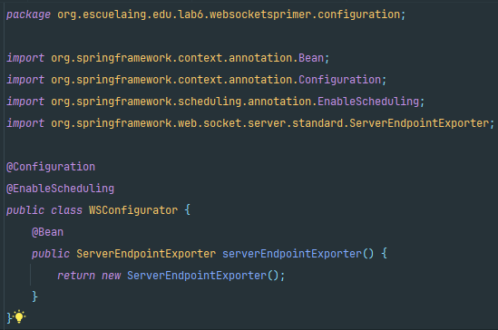

# Spring.io, Websockets y ReactJs

Vamos ahora a realizar un tutorial para implementar una aplicación pequeña que implementa
un a aplicación Web que utiliza Web Sockets.

## Arquitectura

Queremos construir una aplicación web con comunicación bidirectional entre el cliente y el
servidor. El servidor hace un broadcast de un mensaje cada 5 segundos a todos los clientes
conectados. Para realizarlo utilizaremos:

- Spring como servidor web y de aplicaciones
- El browser con Js y ReactJs como cliente pesado
- WebSockets para establecer la conexión bidirectional

### Cree la estructura básica del proyecto:

**1. Crear una aplicación java básica usando maven**

**2. Actualizar el pom para utilizar la configuración web-MVC de spring boot. Incluya lo
siguiente en su pom**

**3. Cree la siguiente clase que iniciará el servidor de aplicaciones de Spring**

Para los pasos 1,2 y 3 hacemos uso de ``spring initializr`` que nos genera de manera automatica todo lo anterior, importante añadir la dependencia de web para el punto 2.

**Clase Main:**

**Archivo POM:**

**4. Cree un controlador Web que le permitirá cargar la configuración mínima Web-MVC**

**5. Cree un index html en la siguiente localización: /src/main/resources/static**

**6. Corra la clase que acabamos de crear y su servidor debe iniciar la ejecución**

**7. Verifique que se esté ejecutando accediendo a ``localhost:8080/status``**

**8. Construyamos el EndPoint el servidor con Websockets:**

**9. Construyamos una clase que emita mensajes desde el servidor:**

**10. Ahora construyamos un componente que nos ayude a configurar el contenedor IoC**

**11. Ahora construimos el cliente Web, el index sería:**

**12. Construyamos el componente ReactJS:**

**13. Finalmente corremos la aplicación para verificar que funciona:**

